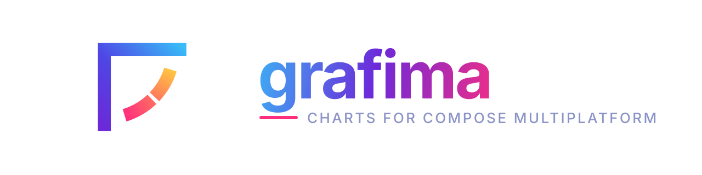

<p align="center">
  
</p>

# Grafima

Charts for Compose Multiplatform. Android, iOS and desktop, one codebase.

Five chart types (bar, line, pie, radar, gauge) drawn on `Canvas`, animated, and
accessible by default.

 ## Demo
| Bar | Line |
| :---: | :---: |
| <video src="https://github.com/user-attachments/assets/ea18ffda-d197-4993-8c21-ab53ec5988c1"></video> |<video src="https://github.com/user-attachments/assets/11a8f662-a679-4a5b-a62d-32a5a9644f4d"></video>|
| **Pie** | **Radar** |
| <video src="https://github.com/user-attachments/assets/5a215fdd-c9f9-43a7-847e-1ce3e6b274cf"></video> | <video src="https://github.com/user-attachments/assets/80f94bac-79df-4c68-b12f-51baa1f96e6b"></video>|
| **Gauge** | |
| <video src="https://github.com/user-attachments/assets/239a3982-68b6-4998-9690-9e9df98265e9"></video>| |

## Install

```kotlin
commonMain.dependencies {
    implementation("io.grafima:grafima:1.0.0")
}
```

On an Android-only project, put it in the usual `dependencies` block instead:

```kotlin
dependencies {
    implementation("io.grafima:grafima:1.0.0")
}
```

## Usage

```kotlin
BarChart(
    dataSet = BarDataSet(
        entries = listOf(
            BarEntry(id = "jan", xLabel = "Jan", y = 45f),
            BarEntry(id = "feb", xLabel = "Feb", y = 80f)
        ),
        contentDescription = "Monthly revenue"
    ),
    modifier = Modifier.fillMaxWidth().height(300.dp)
)
```

## Why it exists

Γράφημα is the Greek word for chart. I'm Greek, so the name picked itself.

I wanted charts I could ship in a real app without a list of things to fix later.
So the hard parts came first: screen readers read them properly, right-to-left
layouts work, setup is quick, and drawing stays cheap.

Those four are the easiest to put off and the slowest to add back. If you need to
move fast without giving them up, that is what this is for.

## What you get

**Accessible.** Every chart is one labelled node, the selection is announced as
state, and each item gets a named action, so nobody has to land a tap on a moving
target. [How it works](docs/ACCESSIBILITY.md)

**RTL throughout.** Mirrored properly, down to which end of a bar is rounded.

**Cheap to draw.** Nothing is allocated per frame, and a running animation
redraws without recomposing.

**Selection is yours.** No chart owns its selection state. You pass it in and get
changes back.

**Tested.** A unit suite on the JVM and an iOS simulator, and a UI suite on an
Android emulator and an iOS simulator, including accessibility contracts every
chart has to pass.
[Test suites](docs/TESTING.md)

## Documentation

Every chart has a guide with a rendered example and the full parameter list:

[Bar](docs/charts/bar.md) · [Line](docs/charts/line.md) ·
[Pie](docs/charts/pie.md) · [Radar](docs/charts/radar.md) ·
[Gauge](docs/charts/gauge.md)

Behaviour shared by every chart is in [Concepts](docs/CONCEPTS.md).

## Requirements

- Android minSdk 24
- iOS: `iosArm64` and `iosSimulatorArm64` (Apple silicon simulators; Compose
  Multiplatform publishes no `iosX64`)
- Desktop: the `jvm` target, for Compose for Desktop hosts
- Kotlin 2.3.21, Compose Multiplatform 1.11.1

## Running the sample

The `sample` module holds the demo UI shared by all three apps.

```bash
./gradlew :androidApp:installDebug     # Android
./gradlew :desktopApp:run              # Desktop
open iosApp/iosApp.xcodeproj           # iOS, then run from Xcode
```

## Contributing

I'm not just maintaining this, I'm still building it. More chart types and more
features are coming.

If you want something changed or added, open an issue first so we can agree on
the shape, then send a PR.

[CONTRIBUTING.md](CONTRIBUTING.md) has the branching model and what CI checks.
[docs/TESTING.md](docs/TESTING.md) covers the test suites and how to run them.

## Contributors

Thanks to [everyone who has contributed](https://github.com/Kyriakos-Georgiopoulos/Grafima/graphs/contributors).

## On AI use

I'd rather tell you than let you guess:

- **Code review.** Three passes per branch, each with a different model.
- **Docs and KDoc.** Drafted with an LLM.
- **Everything was reviewed by me** before release. The design decisions are mine.

Using an LLM on a contribution is fine. Open the PR from your own GitHub account,
not a bot's.

## Changelog

See [CHANGELOG.md](CHANGELOG.md).

## License

Apache 2.0, see [LICENSE](LICENSE).
