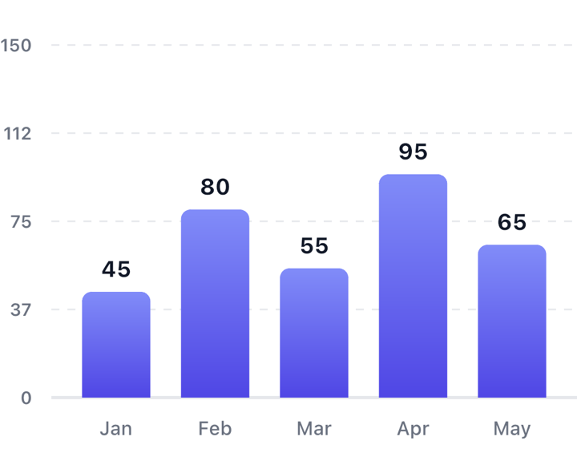

# Bar chart

Vertical or horizontal bars with tap selection, animated entry, and RTL support.



```kotlin
val data = BarDataSet(
    entries = listOf(
        BarEntry(id = "jan", xLabel = "Jan", y = 45f),
        BarEntry(id = "feb", xLabel = "Feb", y = 80f)
    ),
    contentDescription = "Monthly revenue"
)

BarChart(dataSet = data, modifier = Modifier.height(300.dp))
```

## Selection

Selection is hoisted — you own it. The chart tells you what was tapped and
renders whatever you pass back:

```kotlin
var selected by remember { mutableStateOf<BarEntry?>(null) }

BarChart(
    dataSet = data,
    selectedEntry = selected,
    onBarSelected = { selected = it }
)
```

`onBarSelected` fires with the tapped entry, or `null` when the user taps the
same bar again or taps empty space. If you pass a `selectedEntry` that isn't in
`dataSet`, the chart clears it for you.

## Ids matter

`BarEntry.id` is how the chart tracks a bar across data changes. Keep ids stable
and a bar animates from its old value to the new one. Change the id and the
chart treats it as a new bar that grows from zero.

```kotlin
// Same id: Jan animates 45 → 60
BarEntry(id = "jan", xLabel = "Jan", y = 60f)
```

## Orientation

```kotlin
BarChart(dataSet = data, orientation = BarOrientation.Horizontal)
```

Horizontal puts category labels on the left and values along the bottom. In RTL
layouts both orientations mirror, including which end of the bar is rounded.

## Colors

Per-bar gradient, falling back to the dataset default:

```kotlin
BarEntry(
    id = "feb",
    xLabel = "Feb",
    y = 80f,
    gradientColors = listOf(Color(0xFF06B6D4), Color(0xFF3B82F6))
)
```

For control over where colors sit along the gradient, use `colorStops` instead —
it takes priority over `gradientColors`:

```kotlin
colorStops = listOf(
    ColorStop(0f, Color.Green),
    ColorStop(0.8f, Color.Yellow),
    ColorStop(1f, Color.Red)
)
```

## Axis and grid

```kotlin
BarChart(
    dataSet = data,
    axisConfig = AxisConfig(
        yAxisSteps = 5,
        showGridLines = true,
        gridDashPattern = null  // solid grid lines
    )
)
```

`dashEffect` is deprecated and removed in 2.0. It is no longer the way to get a
solid grid: `null` now means *unset* and falls through to `gridDashPattern`. If you
passed `dashEffect = null`, pass `gridDashPattern = null` instead — the compiler
will not warn you, because a deprecated constructor property warns where it is
read, not where it is set.

The y-axis maximum is computed for you: 20% headroom above the tallest bar,
rounded up to a round number so the labels stay readable.

## Animation

Bars stagger in on first appearance and morph on value changes.

```kotlin
animationConfig = AnimationConfig(
    initialEntrySpec = tween(600),
    staggerDelayMs = 60L
)
```

If the user has animations turned off at the OS level, every spec collapses to
`snap()` automatically. See [Accessibility](../ACCESSIBILITY.md) to override that.

## Tooltips

The default tooltip shows the value above the selected bar. Swap it by passing
your own `BarChartSelectionRenderer` — it's a `fun interface`, so a lambda works:

```kotlin
selectionRenderer = TooltipSelectionRenderer(
    backgroundColor = Color(0xFF1F2937),
    cornerRadius = 12.dp
)
```

## Reference

| Parameter | Purpose |
|---|---|
| `dataSet` | Bars and the chart's accessibility description |
| `orientation` | `Vertical` (default) or `Horizontal` |
| `style` | Bar shape, spacing, text styles, floating values |
| `axisConfig` | Y-axis labels, grid lines, step count |
| `animationConfig` | Entry, morph, and selection timing |
| `a11yConfig` | Screen-reader text builders |
| `selectionRenderer` | Draws the selection indicator |
| `selectedEntry` / `onBarSelected` | Hoisted selection state |
| `selectionHaptic` | Haptic on select; `null` to disable |
