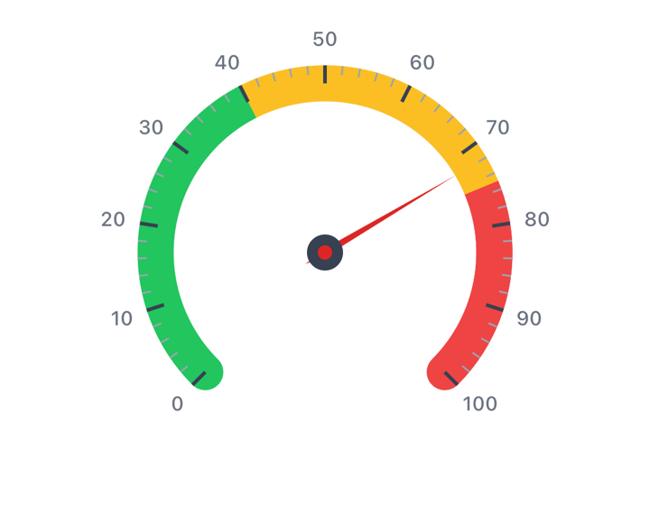

# Gauge chart

A single value on an arc, with a needle. For speed, capacity, progress, scores —
anything with a known range.



```kotlin
GaugeChart(value = 72f, modifier = Modifier.size(280.dp))
```

Unlike the other charts there's no dataset: you pass a value and a range.

```kotlin
GaugeChart(value = 3.4f, minValue = 0f, maxValue = 5f)
```

Values outside the range clamp to the ends rather than overshooting.

## Zones

Colored bands along the arc — the usual green/amber/red:

```kotlin
GaugeChart(
    value = 72f,
    zones = listOf(
        GaugeZone(id = "ok", label = "Healthy", range = 0f..50f, color = Color(0xFF10B981)),
        GaugeZone(id = "warn", label = "Elevated", range = 50f..80f, color = Color(0xFFF59E0B)),
        GaugeZone(id = "high", label = "Critical", range = 80f..100f, color = Color(0xFFEF4444))
    )
)
```

Zone labels aren't drawn, but they are announced — a screen reader says
"Gauge at 72 percent. Value: 72 of 100. Zone: Elevated." Give them names that
read well out loud.

For a continuous sweep instead of discrete bands, use a gradient across the
whole arc:

```kotlin
style = GaugeChartStyle(
    arcGradientColors = listOf(Color(0xFF10B981), Color(0xFFF59E0B), Color(0xFFEF4444))
)
```

A global gradient takes priority over zones — set one or the other.

## Center content

```kotlin
GaugeChart(value = 72f) {
    Column(horizontalAlignment = Alignment.CenterHorizontally) {
        Text("72", style = MaterialTheme.typography.headlineLarge)
        Text("km/h")
    }
}
```

The slot is pushed below the needle hub by `style.centerContentOffset`. If your
content overlaps the needle, increase it.

## Needle

```kotlin
needleConfig = GaugeNeedleConfig(
    style = GaugeNeedleStyle.Tapered,  // or Line
    lengthFraction = 0.8f,
    color = Color(0xFF111827)
)
```

## Arc shape

```kotlin
style = GaugeChartStyle(
    startAngle = 135f,   // 135° = lower-left
    sweepAngle = 270f,   // three-quarter circle
    arcWidth = 20.dp
)
```

For a half-circle gauge, use `startAngle = 180f, sweepAngle = 180f`.

In RTL layouts the needle direction mirrors: the minimum sits at the end of the
sweep instead of the start.

## Ticks

```kotlin
tickConfig = GaugeTickConfig(
    majorTickCount = 10,
    minorTicksPerMajor = 4,
    showLabels = true
)
```

Tick labels are measured once and reused, so tick count doesn't affect frame
cost — but a crowded arc is hard to read. Ten major ticks is usually plenty.

## Accessibility

The gauge exposes its value as progress semantics rather than a live region, so
a screen reader reports it the way it reports any progress indicator. There's
nothing to select, so it has no accessibility actions.

## Reference

| Parameter | Purpose |
|---|---|
| `value` | The value to display; clamped to the range |
| `minValue` / `maxValue` | Range ends; default 0–100 |
| `zones` | Colored bands with labels for screen readers |
| `style` | Arc geometry, colors, gradient, sizing, center offset |
| `tickConfig` | Tick counts, sizes, labels |
| `needleConfig` | Needle shape, length, colors, hub |
| `animationConfig` | Needle spring and start delay |
| `a11yConfig` | Screen-reader text builder |
| `centerContent` | Composable shown below the hub |
