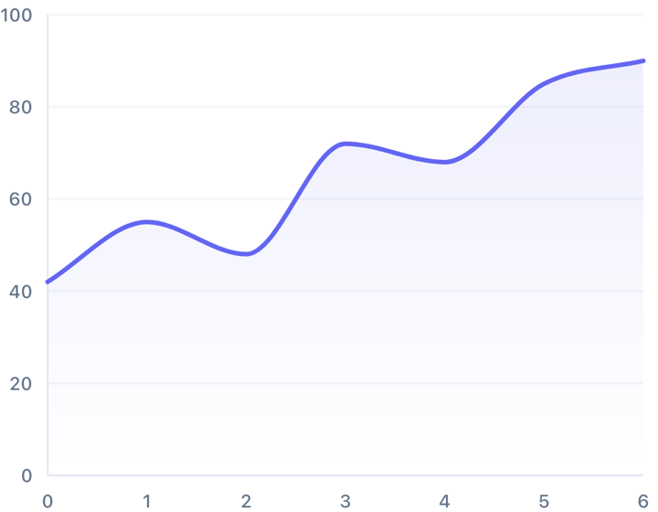

# Line chart

Multi-series line chart with smooth curves, area fills, and a drag crosshair.



```kotlin
val data = LineDataSet(
    series = listOf(
        LineSeries(
            id = "revenue",
            label = "Revenue",
            points = listOf(
                LineDataPoint(x = 0f, y = 10f, label = "Jan"),
                LineDataPoint(x = 1f, y = 25f, label = "Feb"),
                LineDataPoint(x = 2f, y = 18f, label = "Mar")
            )
        )
    ),
    contentDescription = "Quarterly revenue"
)

LineChart(dataSet = data, modifier = Modifier.height(300.dp))
```

`x` is a real number, not an index — points can be unevenly spaced and the chart
positions them correctly.

## Multiple series

Add more entries to `series`. They share the axes and draw in order, so later
series sit on top:

```kotlin
series = listOf(
    LineSeries(id = "2025", label = "2025", points = lastYear, color = Color.Gray),
    LineSeries(id = "2026", label = "2026", points = thisYear, color = Color(0xFF6366F1))
)
```

## Legend

The chart names its series in the tooltip and to a screen reader, but only once
something is selected. `LineLegend` is the key for a chart at rest:

```kotlin
Column {
    LineLegend(dataSet = data)
    LineChart(dataSet = data, modifier = Modifier.fillMaxWidth().height(300.dp))
}
```

It is a separate composable rather than part of the drawing, so you place it
above, beside or below and the plot keeps its full width.

```kotlin
LineLegend(
    dataSet = data,
    orientation = LegendOrientation.Vertical,
    textStyle = MaterialTheme.typography.labelMedium
)
```

A series drawn with `strokeGradientColors` gets a gradient swatch, and one with a
`dashPattern` a dashed swatch, so the key matches the line it names rather than a
flat colour the line never uses.

`Horizontal` wraps onto further lines when the entries do not fit. `Vertical`
takes an `entryAlignment` for the edge the entries line up on.

A screen reader reaches the legend as one item naming every series, rather than a
stop each. `spacing` also sets half that gap between wrapped lines.

## Dot size per series

`LineChartStyle.showDots` decides whether dots are drawn; `LineChartStyle.dotRadius`
sizes them for the whole chart. A series that sets its own `dotRadius` uses that
instead, which is how a marker outweighs the curve it marks:

```kotlin
series = listOf(
    LineSeries(id = "raw", label = "Readings", points = readings, color = Color.Gray),
    LineSeries(
        id = "smoothed",
        label = "Smoothed",
        points = smoothed,
        color = Color(0xFFF97316),
        dotRadius = 7.dp
    )
)
```

A series that leaves `dotRadius` at `Dp.Unspecified` takes the chart-wide value, the
same way `outerRadius` works on the pie and radar charts. `0.dp` drops one series'
dots while the rest of the chart keeps theirs — a derived line such as a moving
average has no readings to mark. `showDots = false` still wins over both: a series
radius sizes a dot, it does not ask for one.

Series need not cover the same x positions. The chart resolves one shared axis for
the dataset, so the crosshair reads each series at the x it stopped on: a one-point
marker is named in the tooltip at its own x and nowhere else, and an x only it reaches
is still selectable by touch and by TalkBack. `selectedPointIndex` counts every x any
series reaches, in ascending order.

Two series that compute the same x by different arithmetic still share a position —
the chart merges values closer together than the data's own smallest gap — while
readings a real step apart stay separate, whether the axis counts months or epoch
milliseconds.

Dots are drawn after every series' fill, so a marker keeps its weight wherever it
sits in the list. The plot and the axis labels both stand off by the widest dot's
radius, so a point on an axis bound is not clipped and does not paint over the
labels — a large radius therefore costs the plot some room on every side.

## Dashed series

A dash says a line is derived rather than measured — a moving average against the
readings it averages:

```kotlin
LineSeries(
    id = "avg",
    label = "7-day average",
    points = average,
    dashPattern = DashPattern(dash = 10.dp, gap = 5.dp)
)
```

`LineLegend` dashes that series' swatch too, so the key matches the line. The area
fill under a dashed stroke is not dashed — the dash describes the line, not the
region beneath it.

A `dash` of `0.dp` gives a dotted line. A pattern that could not be drawn at all —
a negative length, or both lengths zero — leaves the line solid.

`DashPattern` lives in `io.grafima.charts`, not the line package, because the bar
chart's grid takes one too.

## Reference lines

A threshold the data is read against: a target, a limit, or where "now" falls on
an axis of hours.

```kotlin
axisConfig = LineAxisConfig(
    referenceLines = listOf(
        ReferenceLine(value = 14f, axis = ReferenceLineAxis.X, label = "Now"),
        ReferenceLine(
            value = 100f,
            axis = ReferenceLineAxis.Y,
            label = "Target",
            color = Color.Red,
            dashPattern = DashPattern(dash = 6.dp, gap = 6.dp)
        )
    )
)
```

Each line names the axis it is fixed to, so `value` is never ambiguous. `X` stands
a vertical line at an x value; `Y` lays a horizontal one at a y value.

The axis widens to reach the line. A target is normally above what has been
achieved so far, and an axis fitted to the data alone would leave it off the chart
— so `ReferenceLine(100f, Y)` on data peaking at 62 pulls the axis up to 100. Set
`includeInRange = false` to leave the axis to the data, and accept that the line
may then fall outside it and not be drawn.

They are drawn over the series. A marker hidden behind an area fill is not a
marker, and the crosshair still draws over them.

A value outside the axis range draws nothing. Pulling it to the nearest edge would
show a threshold sitting somewhere it is not.

Vertical lines mirror with the axis in RTL, since they are fixed to a data value
rather than to a side of the screen.

`label` is drawn beside the line in the line's own colour, and is announced too —
naming a line once names it for everyone. It claims its space before value labels
do, so the two never print over each other, and a label with nowhere to go is
dropped rather than drawn over something.

Set `contentDescription` as well when the spoken form should say more than the plot
has room for; it defaults to `label`. Either way the chart announces "Reference
line: Now." Override `LineA11yConfig.referenceLineDescriptionBuilder` to reword or
translate that, or return an empty string to leave them unspoken. A line with
neither is drawn but not announced.

An x line well outside the data is worth setting `includeInRange = false` on: an
axis stretched to reach x = 20 for points spanning 0..2 squeezes them into a tenth
of the plot. A y target above the data is the case the widening exists for.

## Value labels

A chart of a few points reads better with its numbers on it than with a tooltip
that has to be found by touch — and a screenshot of one carries the numbers with
it.

```kotlin
style = LineChartStyle(
    valueLabels = LineValueLabelConfig(
        enabled = true,
        formatter = { series, point ->
            if (series.id == "margin") "${point.y.toInt()}%" else "€${point.y.toInt()}"
        }
    )
)
```

`formatter` takes the series as well as the point, as `tooltipFormatter` does, so
two series in different units each carry their own. Return an empty string to leave
a point unlabelled — that is how you print only the last one.

Labels take the side of their point the curve leaves open: below in a valley, above
on a peak, so they do not land on the line itself. Where the plot has no room on
that side they go to the other. One that would overlap a label already drawn is
dropped, so a crowded chart shows what fits rather than stacking text on text. That
applies across series as well as within one.

They are not kept off *lines*, only off each other, so on a busy multi-series chart
a number can still land on a neighbouring stroke. `useSeriesColor` prints each label
in its own series' colour, which says which line it belongs to:

```kotlin
LineValueLabelConfig(enabled = true, useSeriesColor = true)
```

The default tone is a dark slate that holds WCAG AA on a white surface, and a
`textStyle` naming no colour of its own keeps it — so `MaterialTheme.typography`
styles give you their font at the guarded tone. On a dark surface set a colour
yourself, as the sample does; `LineValueLabelConfig().textStyle.copy(color = …)`
keeps the default weight along with it.

The text comes from the value in your data, not the animated one, so it never
counts up during the entry animation.

Nothing is added to the screen reader description. A listener already reaches any
value by selecting its point, and reading all of them out up front would bury the
summary the description opens with.

A point outside a pinned range prints no value, matching its dot. The crosshair
still appears for a point off the y range, as it does without labels.

## Curves

```kotlin
style = LineChartStyle(curveType = LineCurveType.MonotoneCubic)
```

`MonotoneCubic` smooths the line without inventing peaks — it never overshoots
above or below your actual data points, which matters when the line represents
something real. `Linear` connects points with straight segments.

## Area fill

```kotlin
LineSeries(
    id = "revenue",
    label = "Revenue",
    points = points,
    fillAlpha = 0.15f,
    fillGradientColors = listOf(Color(0xFF6366F1), Color.Transparent)
)
```

`fillAlpha` defaults to 0, so there's no fill until you ask for one.

## Crosshair

Press and drag across the chart and the crosshair snaps to the nearest point,
with a haptic tick each time it moves:

```kotlin
var selected by remember { mutableStateOf<Int?>(null) }

LineChart(
    dataSet = data,
    selectedPointIndex = selected,
    onPointSelected = { selected = it }
)
```

`onPointSelected` gives you the index while dragging and `null` on release.
Disable it with `crosshairConfig = LineCrosshairConfig(enabled = false)`.

The index is yours to hold, so it can outlive the data it pointed at. The chart
skips a stale index rather than crashing, but the crosshair disappears — clear
it yourself when the data changes if that matters to you.

## Axes

```kotlin
axisConfig = LineAxisConfig(
    yTickCount = 5,
    includeZeroInYRange = true,
    yLabelFormatter = { "${it.toInt()}k" },
    xLabelFormatter = { "Day ${it.toInt()}" }
)
```

Tick values are rounded to readable numbers (1, 2, 5 × 10ⁿ) that fully contain
your data, so you won't get an axis labelled 3.7, 7.4, 11.1.

`includeZeroInYRange` forces the axis to start at zero. Without it the axis fits
the data, which exaggerates small changes — useful sometimes, misleading others.

`xLabelFormatter` only runs for points that left `label` empty. Set
`LineDataPoint.label` and it is used as it is.

## Axis titles

Labels give the numbers; a title gives them their unit.

```kotlin
axisConfig = LineAxisConfig(
    xAxisTitle = "Days",
    yAxisTitle = "Discomfort strength"
)
```

The x title sits centred below the x labels. The y title is drawn rotated,
reading bottom to top, outside its labels — on the left, or on the right in RTL,
along with the rest of the axis.

Both are announced to screen readers, appended to the chart's description as
"X axis: Days. Y axis: Discomfort strength." Override
`LineA11yConfig.axisTitleDescriptionBuilder` to reword or translate that. A title
left null or blank draws nothing and adds nothing to the description, and the
chart keeps exactly the space it had before.

Titles inherit `labelColor` and `labelFontSize`.

## Pinning the range

Auto-scaling fits each chart to its own data, which is wrong when several charts
have to be read against each other. Pin the range and they share a scale:

```kotlin
axisConfig = LineAxisConfig(
    yMin = 0f,
    yMax = 10f,
    xMin = -1f,
    xMax = 25f
)
```

Each is independent — set one, two, or all four. An unset bound is still
computed from the data.

A pinned bound is used exactly as given. Nice-number rounding is off for that
axis, since rounding works by moving the bound outwards to reach a round step,
and the range is divided into `yTickCount` equal steps instead. Pin `0f..10f`
with the default five ticks and the labels are 0, 2, 4, 6, 8, 10. Pin `0f..7f`
and they are 0, 1.4, 2.8 and so on — pick bounds that divide, or format them
with `yLabelFormatter`.

`yMin` takes precedence over `includeZeroInYRange`.

A line that leaves a pinned range is cut where it crosses the bound and picks up
again where it comes back, leaving a gap. The gap is the point: a line flattened
along the top edge would read as a run of values sitting exactly at `yMax`, when
they are really above it and off the chart.

The two axes suppress different things, because a point off the x axis has no
column to draw in while a point off the y axis still has one:

- **Outside the x range**: no dot, no x-label, no vertical grid line and no
  crosshair at all. It cannot be selected either — touch snaps to the nearest
  point that is on the axis, and no "Select …" action is published for it.
- **Outside the y range**: no dot. The crosshair line and its tooltip still
  appear, because the point has a position along the x axis and its value is
  worth reading even when it sits off the top.

The chart's own description still counts every point, because they are all still
in your data — override `chartDescriptionBuilder` if you would rather it did not.

The area fill is not interrupted by the gap. It is the area *under* the curve, and
where the curve is above `yMax` that area genuinely covers the full height of the
plot, so it is drawn up to the bound.

Setting `selectedPointIndex` yourself is never filtered, so a chart can still be
asked to select a point that is off the x axis. Nothing is drawn for it.

`xMin` is the left edge in LTR and the right edge in RTL, and can be negative —
useful when the axis starts before zero, like a baseline day of `-1`.

A range that cannot work is ignored rather than obeyed: `yMax` below `yMin`, the
two equal, a bound below the data with the other left unset, or a `NaN`. Any of
those would divide by a span of zero or less and stack every point on one edge,
so the axis silently falls back to fitting the data. Both axes behave this way.

Colors sit on the same config:

```kotlin
axisConfig = LineAxisConfig(
    axisColor = Color(0xFF94A3B8),
    labelColor = Color(0xFF475569),
    gridColor = Color(0xFFF1F5F9),
    gridDashPattern = DashPattern(dash = 5.dp, gap = 5.dp)
)
```

`gridDashPattern` replaces `dashedGrid`, which only said whether there was a dash
and measured it in raw pixels. It is the same type the bar chart's grid takes.
`dashedGrid` is deprecated and removed in 2.0; while it is still there, setting it
to true wins over `gridDashPattern`.

## Animation

Points animate up from the baseline, staggered along the line and across series:

```kotlin
animationConfig = LineAnimationConfig(
    entrySpec = tween(700),
    staggerMs = 12L,        // between points
    seriesStaggerMs = 120L  // between series
)
```

## Reference

| Parameter | Purpose |
|---|---|
| `dataSet` | Series and the accessibility description |
| `style` | Curve type, dots, stroke, value labels, minimum size |
| `axisConfig` | Ticks, grid, labels, titles, reference lines |
| `crosshairConfig` | Crosshair and tooltip appearance; enable/disable |
| `animationConfig` | Entry and morph timing, stagger |
| `a11yConfig` | Screen-reader text builders |
| `selectedPointIndex` / `onPointSelected` | Hoisted crosshair position |
| `selectionHaptic` | Haptic per snap; `null` to disable |
