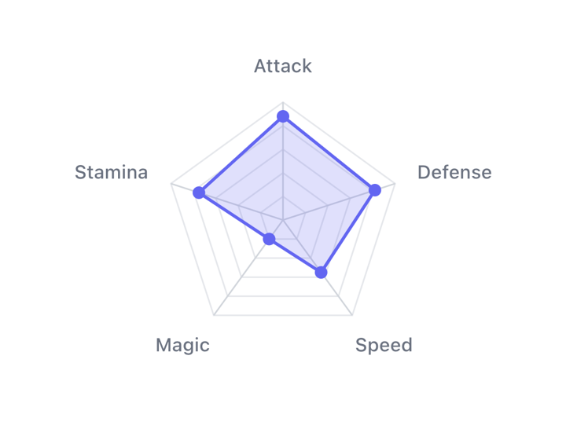

# Radar chart

Compares several series across the same set of axes. Useful when each thing you
are measuring has the same dimensions — product specs, skill profiles, scores.



```kotlin
val data = RadarDataSet(
    axes = listOf(
        RadarAxis(id = "speed", label = "Speed"),
        RadarAxis(id = "power", label = "Power"),
        RadarAxis(id = "range", label = "Range")
    ),
    series = listOf(
        RadarSeries(
            id = "modelA",
            label = "Model A",
            values = mapOf("speed" to 80f, "power" to 60f, "range" to 45f)
        )
    ),
    contentDescription = "Model comparison"
)

RadarChart(dataSet = data, modifier = Modifier.size(300.dp))
```

Needs at least three axes to draw anything.

## Axes and values

`RadarSeries.values` maps axis id to value. Any axis you leave out is treated as
zero, so a partial map is fine:

```kotlin
values = mapOf("speed" to 80f)  // power and range render at 0
```

Each axis normalizes against its own `maxValue` (default 100), so axes measured
in different units still share a shape:

```kotlin
RadarAxis(id = "price", label = "Price", maxValue = 5000f)
RadarAxis(id = "rating", label = "Rating", maxValue = 5f)
```

## Multiple series

```kotlin
series = listOf(
    RadarSeries(id = "a", label = "Model A", values = specsA, color = Color(0xFF6366F1)),
    RadarSeries(id = "b", label = "Model B", values = specsB, color = Color(0xFFEC4899))
)
```

They overlap, so keep `fillAlpha` low — it defaults to `0.2f`. Past three or
four series a radar becomes hard to read; consider a grouped bar chart instead.

## Selection

Tap near a series' vertex to select it. Everything else dims:

```kotlin
var selected by remember { mutableStateOf<RadarSeries?>(null) }

RadarChart(
    dataSet = data,
    selectedSeries = selected,
    onSeriesSelected = { selected = it }
)
```

Removing the selected series from the dataset clears the selection for you.

## Grid

```kotlin
style = RadarChartStyle(
    gridLevels = 5,
    gridStyle = RadarGridStyle.Polygon,  // or Circular
    startAngle = -90f                    // -90 = first axis at 12 o'clock
)
```

`Polygon` follows the axes and makes it easier to read values off the rings.
`Circular` looks cleaner with many axes. Set `gridLevels = 0` to drop the grid.

## Layout

Labels sit outside the rim, so the chart shrinks to make room for them. If your
labels are long, either give the chart more space or turn them off with
`showLabels = false`.

In RTL layouts the axes are laid out counter-clockwise.

## Reference

| Parameter | Purpose |
|---|---|
| `dataSet` | Axes, series, accessibility description |
| `style` | Grid, axis lines, labels, dots, sizing |
| `animationConfig` | Vertex entry and morph timing, stagger |
| `a11yConfig` | Screen-reader text builders |
| `selectionRenderer` | Draws the selection tooltip |
| `selectedSeries` / `onSeriesSelected` | Hoisted selection state |
| `selectionHaptic` | Haptic on select; `null` to disable |
